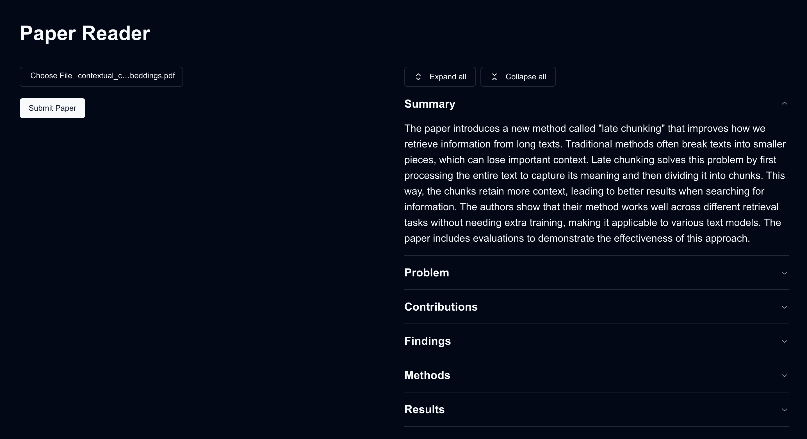

# Paper Reader

_Using LMs to read and summarize research papers._

This project is meant to summarize compsci research papers in pdf form. You can see the output of this below



To get started, clone the repo and make sure you have Docker installed. Then do

```
docker compose up -d --build
```

The application should be live on `http://localhost:3000`

The following information is extracted.

- **Summary:** High level overview of the paper
- **Problem:** Core problem statement the paper seeks to address
- **Contributions:** Claimed contributions to the field
- **Findings:** Summary of basic findings of the paper
- **Methods:** Description of what the authors built or tested
- **Results:** What experiments the authors ran and their results

## Tech stack

- Next.js
- FastAPI
- Unstructured.io
- Llamaindex
